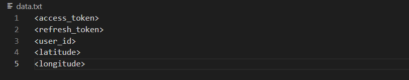

# TooGoodToGo-Scraper

## Table of contents
* [General info](#general-info)
* [Technologies](#technologies)
* [Setup](#setup)

## General info
TooGoodToGo scrapper that notifies user when there is a package avaiable at given store.

## Technologies
Tgtg library for acquiring data, pygame for simple menu. 
Optional: [pushbullet aplication](https://www.pushbullet.com/) for phone notifications.

## Setup
First you need to setup tgtg client, like it is shown here: [client for TooGoodToGo API](https://github.com/ahivert/tgtg-python#readme)
After that you'll acquire acces token, refresh token and user id that you need to paste into data.txt file like this:

If you want to get phone notifications, install pushbullet aplication on your phone, create account and log into it on Your phone and PC. 
Then, on the [pushbullet page](https://www.pushbullet.com/#settings) click "Create Access Token" button and paste the result into notify.py file.
